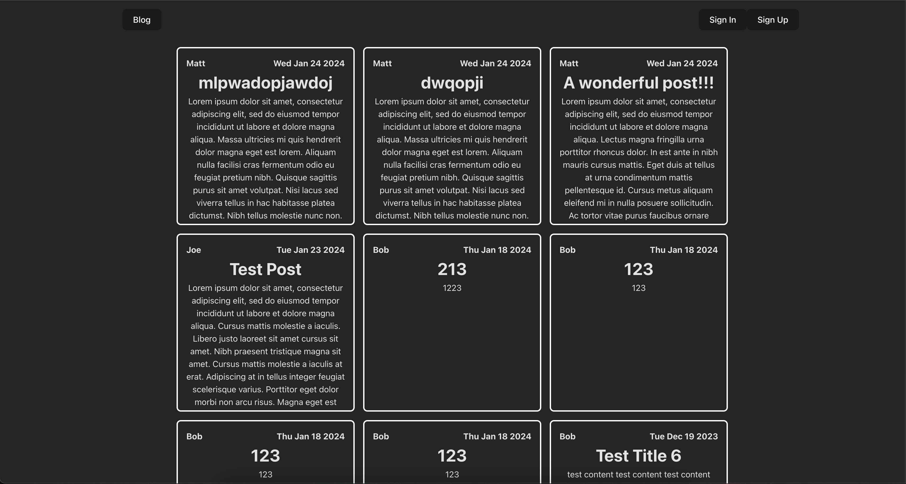
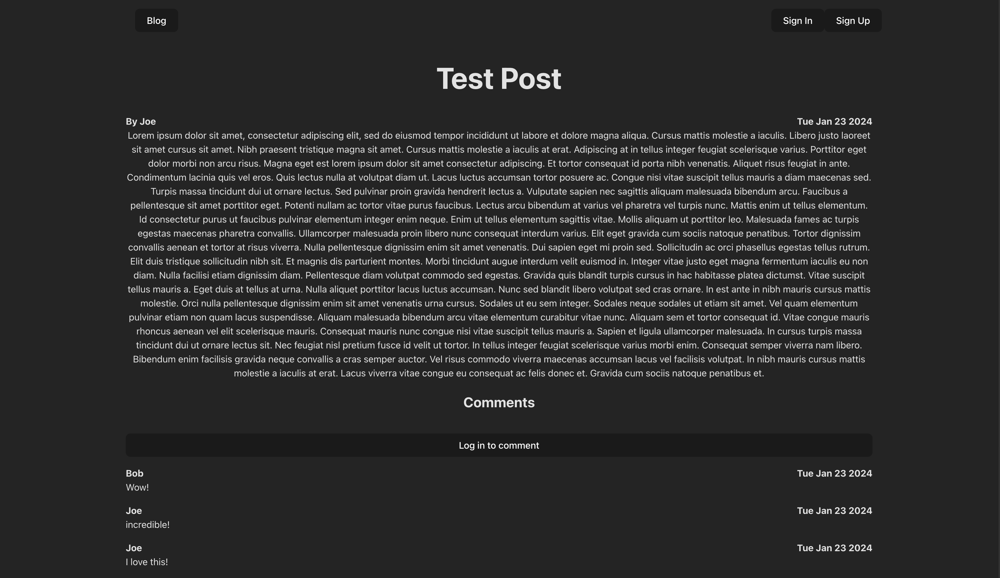

# Blog Project
This fullstack project links an API only backend with two seperate front-end sites. One for creating and editing blog posts and the other for reading and commenting on blog posts.

## Other Repos In This Project
- [Link to API](https://github.com/StickManJ0e/blog-api)
- [Link to CMS](https://github.com/StickManJ0e/blog-cms)

## Built Using
- Node/Express - API Backend
- Mongodb
- Passport JS for local & JWT authentication
- React